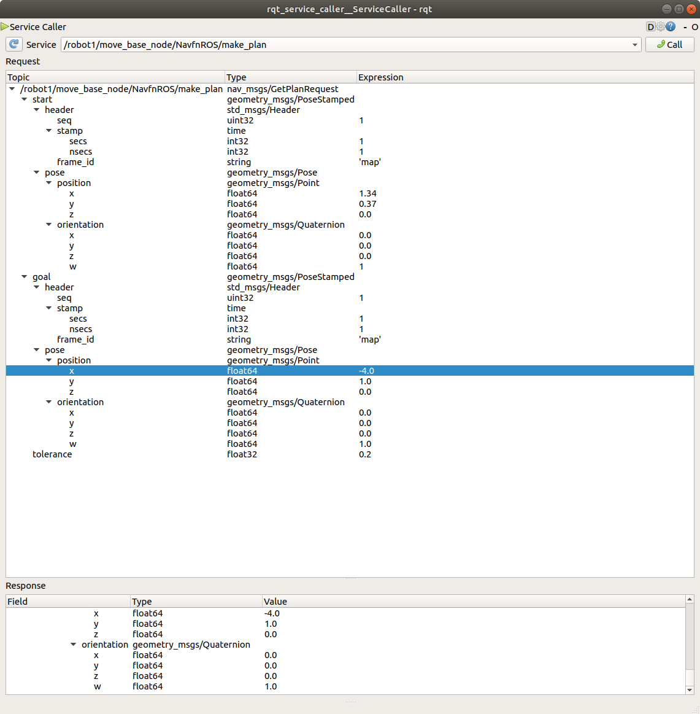

# Przydzielanie zadań w systemie wielorobotwym 

## Planowanie ścieżki 

Przykładowa komenda pozwalające na uzyskanie planu:

`rosservice call /robot1/move_base_node/NavfnROS/make_plan`

Wygodne korzystanie z serwisów zapewnia:

`rosrun rqt_service_caller rqt_service_caller`

poprawna konfiguracja wywołania serwisu:

Wygodna konfiguracja parametrów plannera:

`rosrun rqt_reconfigure rqt_reconfigure`

